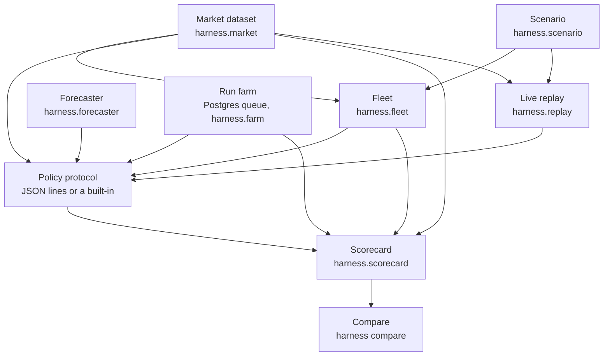

# Capacity-policy test harness

This is a test harness for capacity policies. It replays a policy on real post-RTC+B ERCOT market data and scores what that policy would have earned and risked, including under fleet and rule changes the desk has not lived through yet. The built-in policies (a fixed haircut, two newsvendors, a reliability target) are reference points so a scorecard can tell policies apart. Base plugs in its own policy. The harness is not a competing policy and does not claim to beat one.

Project plan: [docs/handoff.md](docs/handoff.md). Design tradeoffs: [docs/design-notes.md](docs/design-notes.md).

## Architecture

One operating day is the unit. The market dataset and the scenario drive the fleet. The policy protocol turns the observation into reported MW. The scorecard compares that report with the fleet's true deliverable MW and with real prices. Compare ranks policies on shared draws. The run farm fans the same day-run out across workers. Live replay plays one day on a 2-second clock.



| Piece | What it is |
|---|---|
| Market dataset | 5-minute ERCOT prices and AS capability from Dec 5, 2025, loaded offline. [data/README.md](data/README.md). |
| Scenario | One YAML file: fleet, failures, deployment chances, shortfall-cost preset, product rules. [scenarios/baseline.yaml](scenarios/baseline.yaml). |
| Fleet | Quantile mock (P10–P90) or the stochastic failure model. Observed state per region, and true deliverable MW. `harness.fleet`. |
| Policy protocol | A built-in, or a process that speaks JSON lines. [docs/policy-protocol.md](docs/policy-protocol.md). |
| Forecaster | Optional price trajectories attached to the observation before the policy decides. `persistence`, `dam`, `rtd`, `net_load`, `oracle`, or an external command. |
| Scorecard | Per-day sums: revenue, revenue given up, shortfall MW-h, dollar shortfall, over- and under-sold MW-h. |
| Compare | Several policies on several scenarios, one frontier, tolerance tables, and charts. |
| Run farm | One job per policy × scenario × day × seed, leased from Postgres. `harness submit`, `work`, `aggregate`, `bench`. |
| Live replay | Coordinator plus one agent host per region, 2-second ticks, `timeline.json`. `harness replay`. |

## Quickstart

From a fresh clone. The interval table builds from public MIS files without an ERCOT API key. Set `ERCOT_API_USERNAME`, `ERCOT_API_PASSWORD`, and `ERCOT_PUBLIC_API_SUBSCRIPTION_KEY` when you have them: that is the archive route for AS demand curves, which the headline comparison does not read. `make market-data` fetches only missing days, from Dec 5, 2025 through yesterday.

```bash
make install        # .venv with the harness and dev tools
make market-data    # data/market, offline after this
make backtest       # headline comparison, writes docs/insights/compare/
make bench          # run-farm benchmark; needs Postgres first (below)
make replay         # 5 simulated minutes of the demo day
make chaos          # same replay; the seeded chaos schedule is the stretch
```

`make bench` creates a throwaway database on the Postgres in [compose.yaml](compose.yaml):

```bash
docker compose up -d --wait
make bench
```

One policy, one scenario, one day:

```bash
.venv/bin/harness run --scenario scenarios/baseline.yaml --start 2026-08-20 --end 2026-08-31
```

Pass `MARKET_DIR=` on the make targets to score a dataset that is not `data/market`. `make test` runs the offline tests from recorded ERCOT fixtures. `make typecheck` runs mypy.

## Headline comparison

`make backtest` is the command. It scores `constant_haircut`, `independent_newsvendor`, `correlated_newsvendor`, and `reliability_target` on `baseline`, `caps_lifted`, and `nonspin_2h`, from 2026-08-11 through 2026-08-17, seed 7, and charts 2026-08-17. The published writeup, charts, and the checkout-specific invocation that produced them are in [docs/insights/compare-findings.md](docs/insights/compare-findings.md). Running `make backtest` rewrites `docs/insights/compare/`.

The scarcity flag is a percentile over the days that are stored, so extending the dataset can change which intervals count as scarce ([data/README.md](data/README.md#scarcity-proxy)). The published numbers are the ones in the findings.

On that week the harness separates the policies on dollars. On the P50 fleet every policy saw, shortfall is 0.000 MW-h. Rankings hold when the pilot cap lifts from 100 MW to 500 MW, and the correlated newsvendor passes the haircut when Non-Spin drops to 2 h. Full numbers are in the findings.

## Benchmark

`make bench` is the command. The sweep is [docs/bench/sweep.yaml](docs/bench/sweep.yaml): `constant_haircut` and `reliability_target` on `baseline`, 2026-08-20 through 2026-08-21, seed 1 (four jobs). It prints scenario-days per minute at 1, 8, and 32 workers, then the time to finish after 20% of the workers are killed and how many jobs were re-run. It writes that table to `docs/bench/bench.md`, replacing the file. The recorded run is:

| Workers | Scenario-days/min |
| ---: | ---: |
| 1 | 18.464 |
| 8 | 16.585 |
| 32 | 14.141 |

Killing 6 of 32 workers partway through that sweep took 14.218 seconds to finish and re-ran 3 jobs. Wall times are from that machine. The saved table is [docs/bench/bench.md](docs/bench/bench.md).

## Live replay

`make replay` plays the demo day, 2026-08-17, the operating day the headline comparison charts (highest settlement prices that week: ECRS $22.90/MW-h, Non-Spin $91.53/MW-h). It runs `harness replay` for 5 simulated minutes at the default 2-second tick and writes `data/replay/timeline.json`. Omit `--minutes` on the command below to play the whole day.

`make chaos` runs that same replay. `harness replay` has no chaos-schedule flag. The Python API can already stop a host, delay or drop heartbeats, partition a region, duplicate commands, and restart the coordinator from Postgres; a seeded schedule of those faults is the live-replay stretch, and it is not a CLI command yet. `make chaos` will point at that schedule when it lands. Until then it replays the demo day.

Worker-kill chaos on the run farm is a different command, `harness chaos`, and `make bench` already measures recovery after killing 20% of workers. `make chaos` does not call `harness chaos`.

```bash
.venv/bin/harness replay --scenario baseline --policy constant_haircut \
    --day 2026-08-17 --minutes 5 --out data/replay
```

## How Base plugs in

**Policy.** `--policy` is a built-in name or a shell-quoted command. An external policy is its own process. The harness writes one JSON object per line to stdin and reads one JSON object per line from stdout. Copy [examples/constant_haircut_policy.py](examples/constant_haircut_policy.py). The protocol is language-agnostic (Base writes Go and Python); the template is Python. Details, the timeout, and the fallback (`last_good` or `zero`) are in [docs/policy-protocol.md](docs/policy-protocol.md).

```bash
.venv/bin/harness run \
    --policy "python examples/constant_haircut_policy.py --fraction 0.9" \
    --scenario scenarios/baseline.yaml --start 2026-08-17
```

`--param` applies only to built-ins. `--decision-timeout` defaults to 1 second. A timeout, crash, or malformed reply counts against the scorecard and the run continues.

**Telemetry and failures.** Both are the scenario file, not code. `fleet` is the hardware, the SOC draw, the stale-telemetry threshold, and which fleet-state model runs. `failures` is the stochastic model: per-hour home dropouts, regional outages, a scarcity multiplier, and forced outages at set times. `deployments` is the chance ERCOT calls, by calm versus scarce, plus a refill rate. Replace [scenarios/baseline.yaml](scenarios/baseline.yaml), or add a file that `extends` it, and pass that path as `--scenario`. [scenarios/storm_houston.yaml](scenarios/storm_houston.yaml) is the storm rates from the handoff plus a forced regional outage. A path to a CSV of quantile shares, relative to the scenario file, replaces the flat placeholder shares with a table by CPT month and hour.

Question 6.2 asks whether Base's policy can sit behind JSON in and MW out. Question 6.5 asks whether a config-driven failure model Base can swap for its own telemetry is useful.

## Real ERCOT data and assumptions

Prices the scorecard charges against are measured. The fleet the policy is scored on is a scenario. `Scorecard` labels the split (`input_labels`):

| Input | Kind | Where it comes from |
|---|---|---|
| RT MCPC, 5-minute and 15-minute settlement | Real | NP6-332-CD, NP6-331-CD, history files NP6-795-ER and NP6-796-ER |
| Day-ahead MCPC, AS capability, AS demand curves | Real, in the dataset | NP4-188-CD, NP6-328-CD, NP4-212-CD. Scoring the headline comparison does not read them |
| Load-zone settlement prices | Real | NP6-905-CD. The scenario picks which zone is λ |
| Base's own ADER rows (`harness.base_actual`) | Real, 60-day lag | NP3-965-ER, QSE `QBASTX`. A grading source, not the baseline fleet |
| Scarcity flag | Assumption | An interval is scarce when its 5-minute RT MCPC is above that product's 99th percentile over the stored dataset. The percentile looks ahead. [data/README.md](data/README.md#scarcity-proxy) |
| Deployment on a scarce or calm interval | Assumption | Drawn from `deployments` in the scenario |
| Fleet size, SOC, quantile shares, dropouts, outages | Assumption | The scenario. Hardware numbers below are the published Base Core spec |
| Refill rate, shortfall-cost preset, compliance $/MW, Set Point Deviation $/MWh | Assumption | The scenario. See the design notes |

The award is `min(reported MW, cap × cap share)`. That is the price-taker assumption in question 4.3: offers near $0.01, so the policy chooses a quantity and the cap share is the limit. Question 4.3 is open.

## Scenario assumptions

Every field of [scenarios/baseline.yaml](scenarios/baseline.yaml) is required; a typo is an error rather than a silent default. The values below are that file. PLACEHOLDER marks a number the handoff or the question list already calls an assumption. The question column is the open item in [docs/questions.md](docs/questions.md) whose answer would replace the number. Nothing here is that answer.

| Field | Baseline | Source | Question that would replace it |
|---|---|---|---|
| `seed` | 7 | Harness default so a run can be repeated. Not a claim about Base. | Pass `--seed`. No engineer question. |
| `fleet.homes` | 1000 | PLACEHOLDER. Handoff §8 toy fleet. | 4.5, and the fleet-size note under 6.6. |
| `fleet.regions` | 10 | PLACEHOLDER. Handoff §8, ten equal failure domains. Home *i* is in region *i* mod 10. | 2.1. |
| `fleet.battery_kwh` | 39.2 | Base Core, handoff §1. | 1.1, if the pack behind the capability number differs. |
| `fleet.inverter_kw` | 20 | Base Core, handoff §1. | 1.1, same. |
| `fleet.backup_floor` | 0.20 | Base keeps at least 20% SOC, handoff §1. | 1.5 (fixed floor, or dynamic with outage forecasts). |
| `fleet.soc` | Beta(6, 4), mean 0.6 | PLACEHOLDER. Handoff §8 toy draw, one draw per home per day. | 1.5 and the 60% SOC line under 6.6. |
| `fleet.telemetry_stale_s` | 180 | Base's published rule, handoff §1. | 2.3. |
| `fleet.state` | `quantile` | Which model drives the run. `stochastic` uses `failures` instead. [scenarios/stochastic.yaml](scenarios/stochastic.yaml) is that switch. | 2.1, which decides whether the default model is linked failures. |
| `fleet.quantile_mock.shares` | P10 0.80, P25 0.87, P50 0.92, P75 0.96, P90 0.98 | PLACEHOLDER flat shares of homes available. The file points at a later calibration from Base's public telemetry. A CSV path replaces the table. | 2.3 (share of the fleet dark, calm versus storm) and 6.6. |
| `fleet.quantile_mock.policy_view` | `typical` | One decision from the typical fleet, scored against every quantile. `per_case` decides from each quantile's own fleet. | 1.1 and 6.2 (what the policy consumes). |
| `fleet.quantile_mock.typical` | P50 | The quantile `typical` shows the policy. | 1.1 and 6.2. |
| `failures.home_dropout_per_h` | 0.01 | PLACEHOLDER. Handoff §8 calm chance of losing a home during one deployment window, used here as a chance per hour. Storm 0.04 is [scenarios/storm_houston.yaml](scenarios/storm_houston.yaml). | 2.1 and 6.6. |
| `failures.home_dropout_min` | 60 | PLACEHOLDER. The handoff gives no outage duration. | 2.1. |
| `failures.region_outage_per_h` | 0.005 | PLACEHOLDER. Handoff §8 calm regional chance (0.5%) during one window, used as a chance per hour. Homes in that region go to backup. Storm 0.08 is `storm_houston`. | 2.1 and 6.6. |
| `failures.region_outage_min` | 120 | PLACEHOLDER. No duration in the handoff. | 2.1. |
| `failures.scarcity_stress` | 4 | PLACEHOLDER. Both per-hour chances are multiplied by this in intervals the dataset flags scarce. | 2.1 and 6.6. |
| `failures.forced_region_outages` | none | Empty. The storm scenario forces region 0 at 2026-08-26 18:00 CPT for 240 minutes. Region 0 stands in for Houston. | 6.3 and 6.4 (a real region, and a known bad day). |
| `deployments.calm` | 0.02 | PLACEHOLDER. Chance ERCOT deploys in a calm interval. Listed under question 6.6. "How to identify deployments in public data" is still open in handoff §7. | 3.3 and 6.6. |
| `deployments.scarce` | 0.30 | PLACEHOLDER. Chance in an interval the dataset flags scarce. Same list under 6.6. | 3.3 and 6.6. |
| `deployments.refill_kw` | 5 | PLACEHOLDER. kW an online home recharges. | 3.3. |
| `deployments.forced` | none | Empty. A forced call is a product, a CPT start, and a duration. | 6.4. |
| `scoring.preset` | `energy` | Assumption, standing in for an unanswered settlement question. Load-zone price × shortfall × duration. The other presets are `energy_spd` and `imbalance`. [docs/design-notes.md](docs/design-notes.md#shortfall-cost-presets). | 3.1. |
| `scoring.load_zone` | HOUSTON | PLACEHOLDER. Which load zone's real-time price is λ. The price series itself is measured. | 3.1. |
| `scoring.compliance_per_mw` | 500 | PLACEHOLDER. $/MW short, added under every preset. Handoff §8 toy and the list under 6.6. | 3.2. |
| `scoring.spd_per_mwh` | 50 | PLACEHOLDER. $/MWh, used only by `energy_spd`, and only on shortfall beyond the lesser of 3% of the award or 3 MW. That band is the Set Point Deviation description in question 3.1; it is fixed in `harness.scenario`, not a YAML field, and it is not confirmed for ADER groups. | 3.1. |
| `scoring.exceedance_mw` | 0, 1, 5, 10, 25, 50 | Grid for the exceedance curve, P(hourly shortfall ≥ x). Chosen so the curve can be drawn. | 3.1, which asked for under-serving of at least X MW. The X values are still this grid. |
| `scoring.tolerance_mw` | 1, 5, 10, 25 | Grid for the tolerance table. | 3.1, same. |
| `products.ECRS.duration_h` | 1 | Nodal Protocols §8.1.1.3.4. §3.17.4 says 2 h; [scenarios/ecrs_2h.yaml](scenarios/ecrs_2h.yaml) is that case. | 1.3. |
| `products.ECRS.cap_mw` | 100 | ADER pilot cap, system-wide. [scenarios/caps_lifted.yaml](scenarios/caps_lifted.yaml) uses 500. | 4.4. |
| `products.ECRS.cap_share` | 0.9 | One QSE may hold at most 90% of the cap. | 4.4. |
| `products.NONSPIN.duration_h` | 4 | Current Non-Spin duration. 2 h once NPRR1309 is in; [scenarios/nonspin_2h.yaml](scenarios/nonspin_2h.yaml). | 1.4. |
| `products.NONSPIN.cap_mw` | 100 | Same pilot cap. | 4.4. |
| `products.NONSPIN.cap_share` | 0.9 | Same 90% QSE share. | 4.4. |

Presets that only change a knob `extend` baseline: `caps_lifted`, `nonspin_2h`, `ecrs_2h`, `fleet_10x` (1,000 homes and 10 regions become 10,000 and 100), `storm_houston`, and `stochastic`.

## Run a policy

```bash
.venv/bin/harness run --scenario scenarios/baseline.yaml --start 2026-08-20 --end 2026-08-31
.venv/bin/harness run --policy constant_haircut --param fraction=0.8 \
    --scenario scenarios/stochastic.yaml --start 2026-03-08 --seed 3
.venv/bin/harness run \
    --policy "python examples/constant_haircut_policy.py --fraction 0.9" \
    --scenario scenarios/baseline.yaml --start 2026-03-08 --seed 3
```

The command prints a scorecard for each fleet case. It also writes two files to `data/runs/<scenario>_<policy>_<start>_<end>_seed<seed>/` (or `--out DIR`):

- `scorecard.json`, with one scorecard per fleet case. Each records `policy_view` and `observed_case`: the view that was used, and the fleet the policy saw.
- `intervals.parquet`, the per-interval data dump.

`--end` defaults to `--start`, and `--seed` defaults to the scenario's `seed`. Run `harness run --help` for every option.

Python equivalent:

```python
from harness import ConstantHaircut, load_scenario, run

result = run(ConstantHaircut(fraction=0.9), load_scenario("scenarios/baseline.yaml"), start, end)
result.scorecards["P10"].totals["ECRS"].oversold_mw_h
```

### How a run works

- **One operating day is the unit of simulation.** A date-range run scores each CPT day on its own and combines the results. So it equals the combination of single-day runs (`Scorecard.combine`).
- **Fleet state has two modes** (`fleet.state`), both in `harness.fleet`. Each yields its own fleet cases, and each case gets its own scorecard. All cases are scored on the same market data.

  | Mode | Fleet cases | What varies |
  |---|---|---|
  | `quantile` (primary) | `P10`, `P25`, `P50`, `P75`, `P90` | A quantile mock gives the share of homes available, by CPT month and hour. Homes are ranked once per day, so a higher quantile always has more homes. Nothing fails mid-window. |
  | `stochastic` | `stochastic` | Homes drop out, and regions (the failure domains) have grid outages. Both are random, per hour, and multiplied by `scarcity_stress` in scarce intervals. Forced regional outages can be added at set times. |

- **SOC** is fixed or drawn per home and day. Within the day it falls when a deployment is delivered, and online homes refill at `deployments.refill_kw` in intervals that deliver nothing.
- **What the policy sees depends on the view.** It receives an observation and returns the MW it reports for each product (`{"ECRS": ..., "NONSPIN": ...}`).

  | `fleet.quantile_mock.policy_view` | Calls per interval | What the policy sees |
  |---|---|---|
  | `typical` (the default) | one | The `typical` quantile's fleet. That one report is scored against every quantile's true deliverable MW. |
  | `per_case` | five, one per quantile | Each quantile's own fleet. |
  | stochastic mode | one, for the `stochastic` case | That case's own fleet. Stochastic mode always decides per case. |

  `typical` measures planning uncertainty: reality turns out worse or better than the fleet the policy planned for. Stochastic mode measures operational uncertainty: homes and regions drop out during the deployment window. In `per_case` the policy must not carry state from one quantile to the next; in `typical` there is only one call per interval.
- **The observation has six sections:**

  | Section | Contents |
  |---|---|
  | `now` | The interval's market row: start time (UTC and CPT), 5-minute RT MCPC and scarcity flag per product, RT price per load zone |
  | `fleet` | Observed state per region, at the interval's start |
  | `products` | Duration, pilot cap, and cap share per product |
  | `history` | Empty for now |
  | `forecasts` | Latest forecast vintages posted at or before the interval, when `--forecasts` points at a forecast-input store. Empty otherwise |
  | `forecaster` | Filled when `--forecaster` is set. Empty otherwise |

  The `fleet` section, per region: `homes`, `homes_online`, `homes_stale` (telemetry older than `telemetry_stale_s`), `homes_backup`, `energy_above_floor_kwh`, `inverter_kw`, and `capability_kw` per product. Stale and backup homes are excluded from the online totals. A home that dropped out more recently than the stale threshold still looks online. `now` includes that interval's prices and its scarcity flag. The flag's default threshold is a percentile over the whole dataset, which looks ahead.
- **Deliverable MW (D)** is the true MW the fleet could sustain if deployed. It counts only homes available for the product's whole duration from the interval's start: the sum of min(inverter kW, (SOC − floor) × kWh ÷ duration). A window that runs past midnight uses that day's draws.
- **Scoring**, with K the reported MW and an award `min(K, cap × cap share)`:
  - Exposure, over every interval: over-sold = max(K − D, 0) and under-sold = max(D − K, 0), in MW-h; overstatement rate = the share of intervals where K > D.
  - Dollars, over intervals whose settlement price is `ok`: revenue = award × 15-minute RT settlement MCPC × 5/60 h. Revenue given up is the regret against a hindsight oracle that reports exactly D. It is never negative.
  - Shortfall MW-h is max(award − D, 0) on intervals drawn as deployed. Dollar shortfall follows the scenario preset plus `compliance_per_mw`. See [docs/design-notes.md](docs/design-notes.md#shortfall-cost-presets).
  - Unpriced intervals are counted (`skipped`) and left out of the dollar sums.
- **The scorecard stores per-day sums and counts, never rates.** It also counts timeouts, malformed replies, restarts, and fallbacks from an external policy.
- **Randomness** comes from `harness.RandomStreams`, one stream per (scenario, seed, day, stream name). The policy is not part of the key. The scenario name is, so two presets do not share draws. See [docs/design-notes.md](docs/design-notes.md#common-random-numbers).

### Data dump (`intervals.parquet`)

The dump has one row per 5-minute interval, fleet case, and product. Columns:

- `interval_start_utc`, `interval_start_cpt`, `operating_day`
- `fleet_case`, `policy_view`, `observed_case`, `product`
- `reported_mw`, `deliverable_mw`, `award_mw`, `oversold_mw`, `undersold_mw`
- `rt_mcpc_5m`, `rt_mcpc_15m`, `scarce`
- `priced`, `revenue`, and `revenue_given_up` (the last two are `NaN` when not priced)
- `lz_spp_{houston,north,south,west}`

Summing by fleet case and product gives the scorecard's totals: the dollar columns sum directly, and the MW columns sum × 5/60 h.

## Other entry points

```bash
.venv/bin/harness compare --help
.venv/bin/harness value --policy independent_newsvendor --forecaster persistence \
    --scenario baseline --start 2026-08-17 --out data/value
.venv/bin/harness forecast --help
docker compose up -d --wait
.venv/bin/harness submit --sweep docs/bench/sweep.yaml
.venv/bin/harness work
.venv/bin/harness aggregate --out data/runs/sweep --compare-out data/runs/compare
.venv/bin/harness bench --sweep docs/bench/sweep.yaml --out docs/bench
```

`harness value` scores one policy with a forecaster, the persistence forecast, and an oracle that sees the realized prices. `make forecast-data` builds the point-in-time forecast-input store.
